# Creating a build pipeline

A build pipeline implements Continuous Integration. It can automate buildong of code and running tests when code is committed.

- [Creating a build pipeline](#Creating-a-build-pipeline)
- [Add jobs to the pipeline](#Add-jobs-to-the-pipeline)
- [Run the build pipeline](#Run-the-build-pipeline)
- [Implementing Continuous Integration](#Implementing-Continuous-Integration)

## Creating a build pipeline

Go to Pipelines, then click on create pipeline::

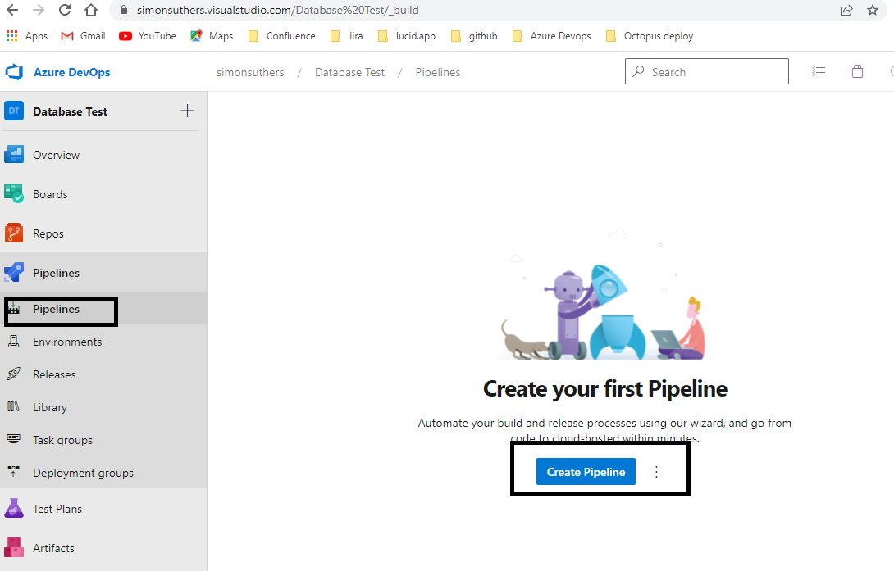

Click on use the classic editor to use the GUI to create the pipeline:

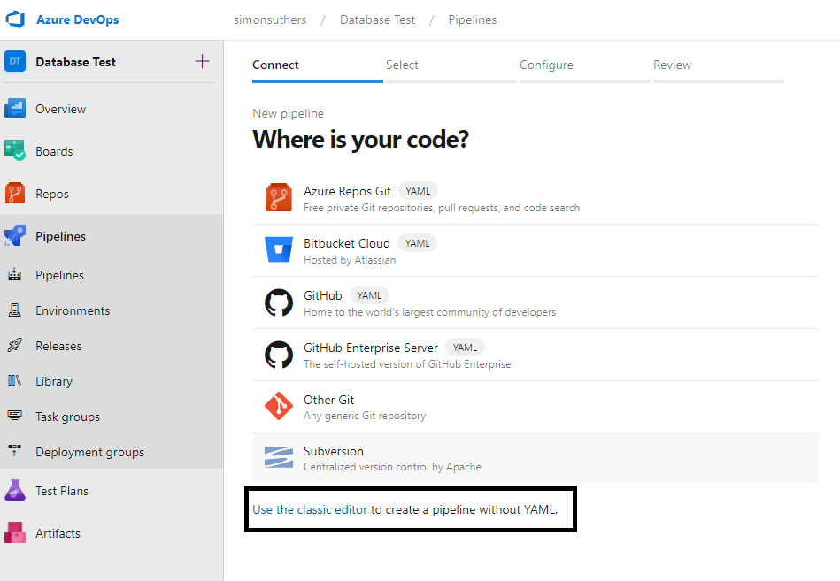

Select the current repo where the code is stored, then press continue:

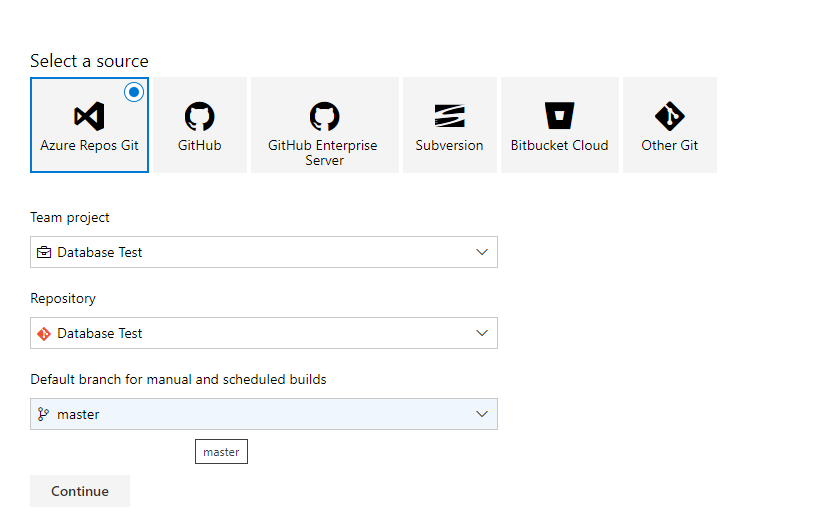

Choose an empty job as the template:

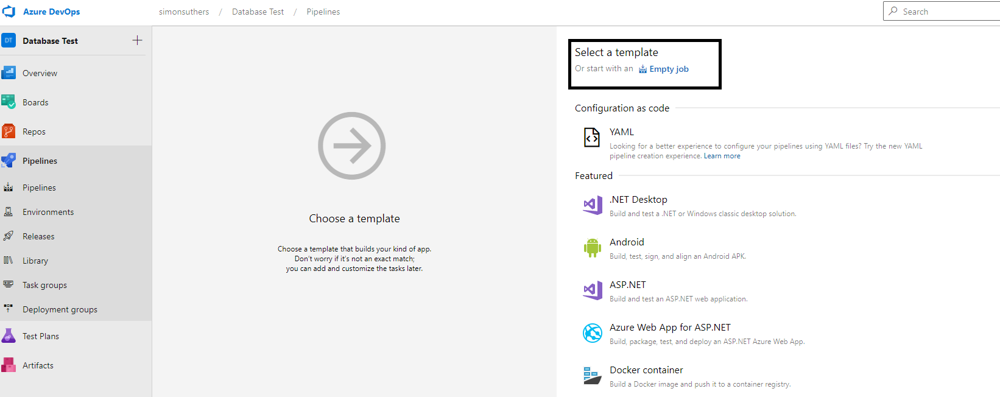

## Add jobs to the pipeline
Jobs are actions executed by the pipeline. This example has 1 job that has 4 tasks:
- Build the solution
- Run tests in the solution
- Create an artifcact of the solution using the Copy Files task
- Publish the artifacts

An agent job is created automatically. Click on the + sign to add a task:

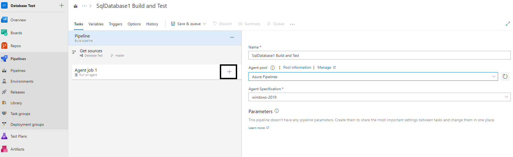

Find the Visual Studio build task and add it:

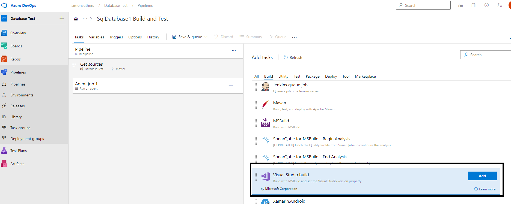

Set the relevant settings. In this example, only the database project is built:

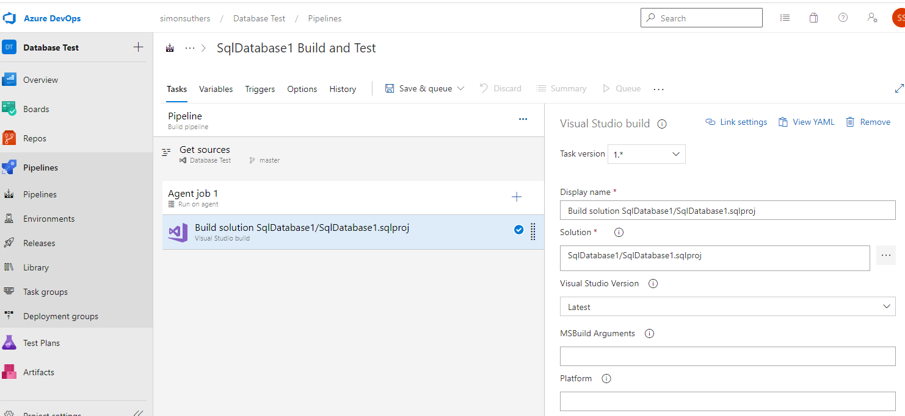

Click o the + sign again and find the Copy files task:

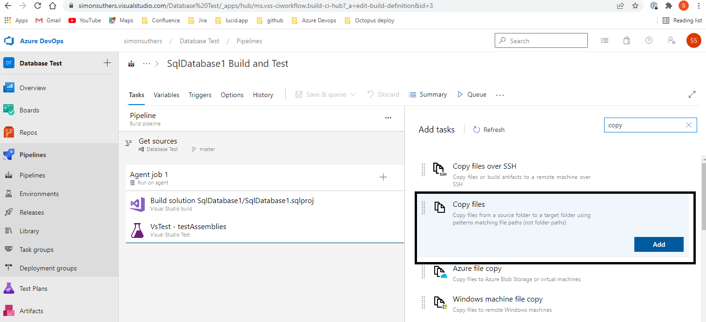

Use the info buttons to add the relevatn defaults:
- Source folder:  $(agent.builddirectory)\s
- Target folder: $(build.artifactstagingdirectory)

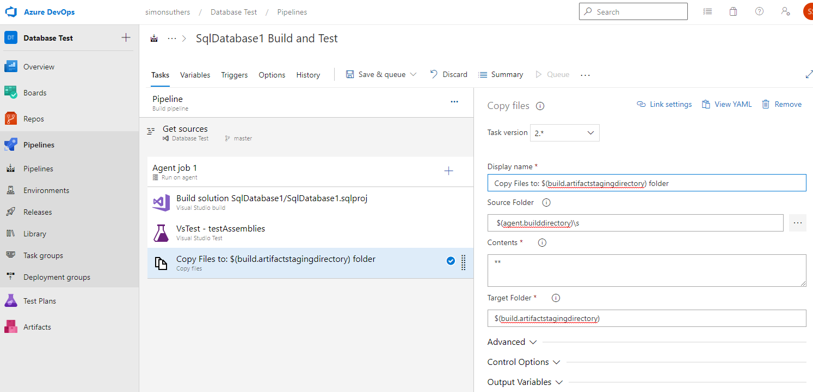

Click on the + sign and find Publish Build artifacts:

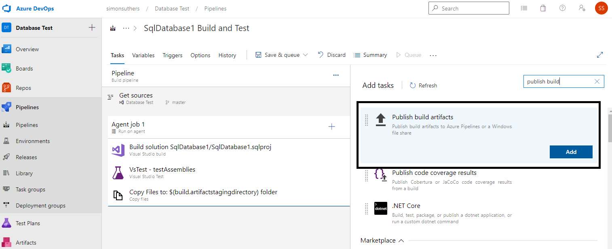

Set the relevant settings, then click on save:
- Path to Puslish: $(Build.ArtifactStagingDirectory)

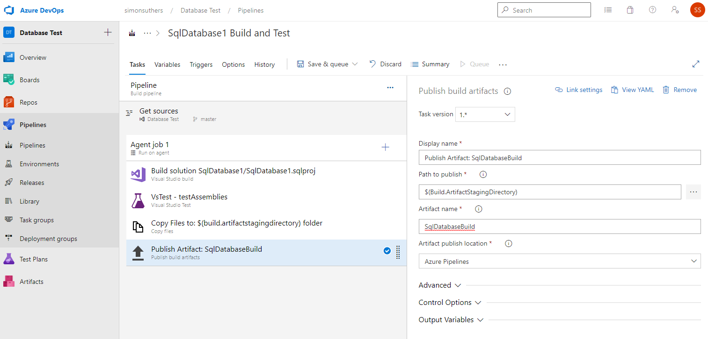

## Run the build pipeline

In the main pipeline window, click on the pipeline:

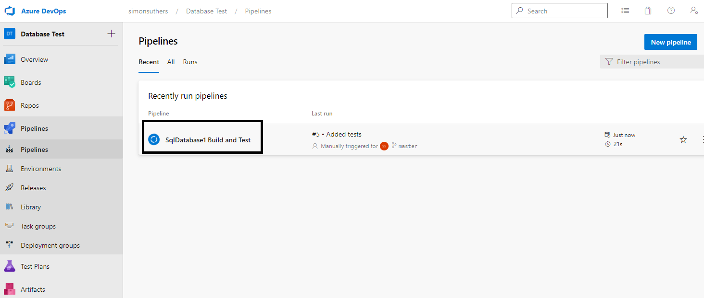

To run the pipeline, click on Run Pipeline:

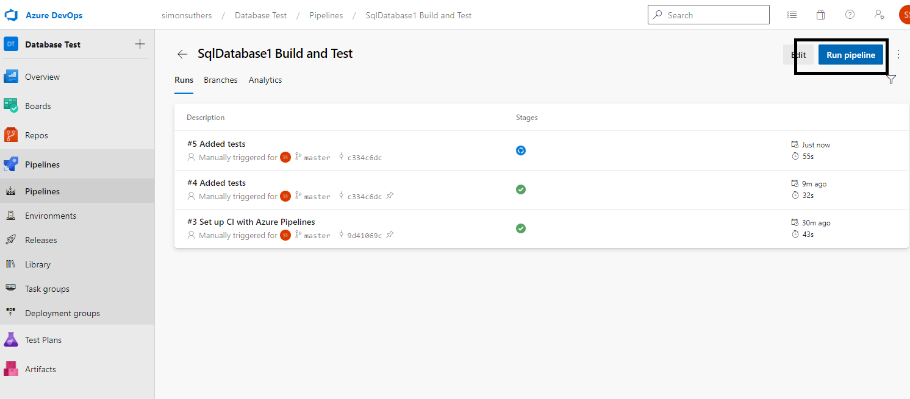

In the pop-up, press run:

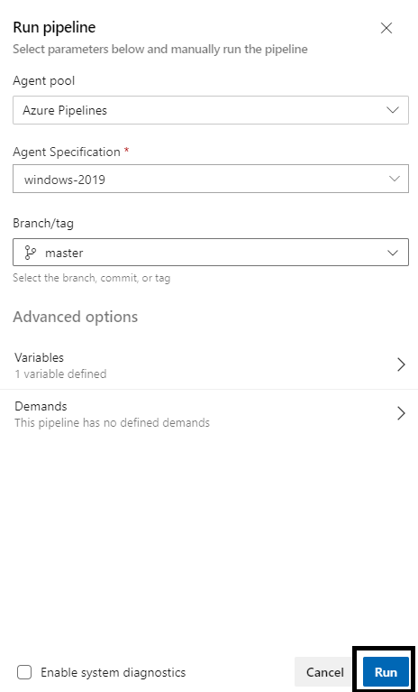

## Implementing Continuous Integration
