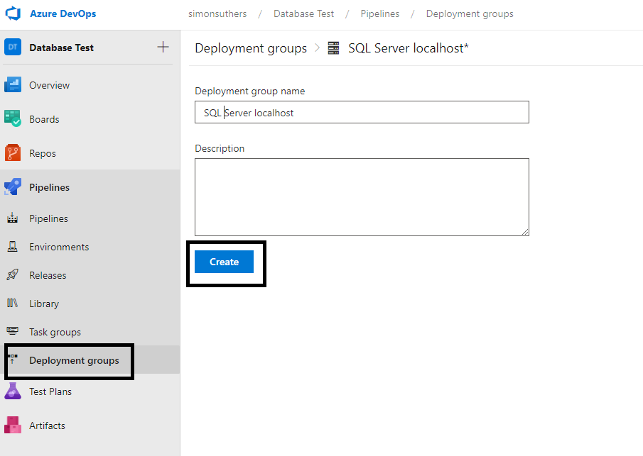
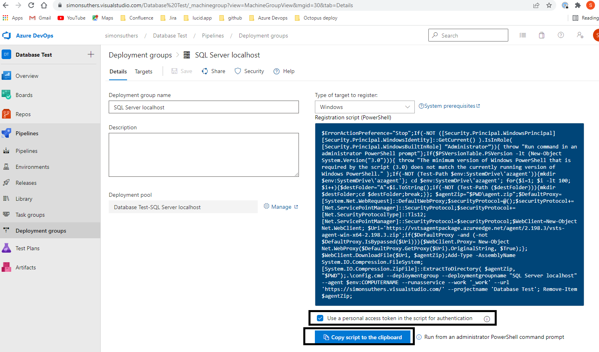
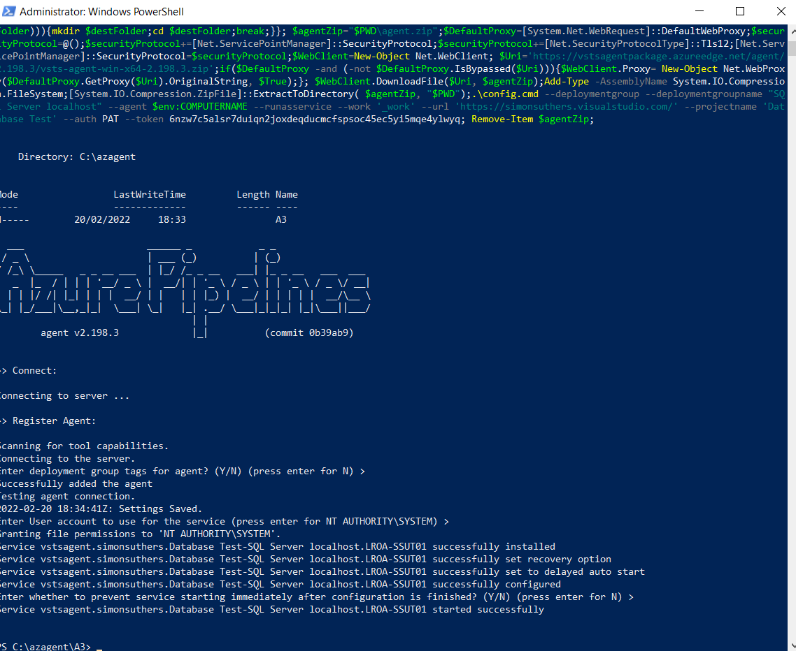
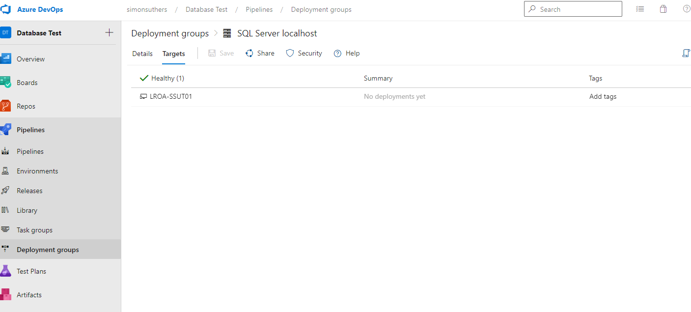
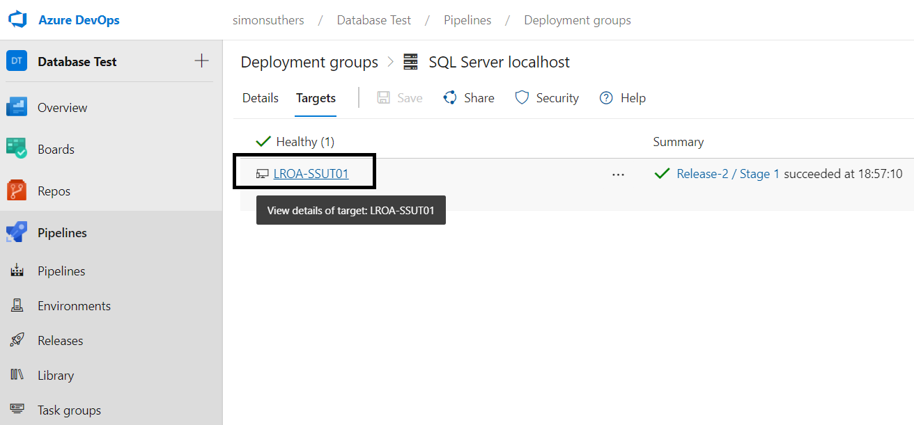
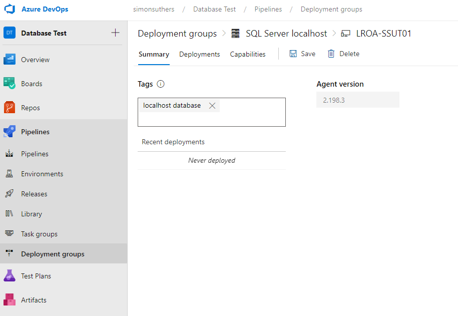
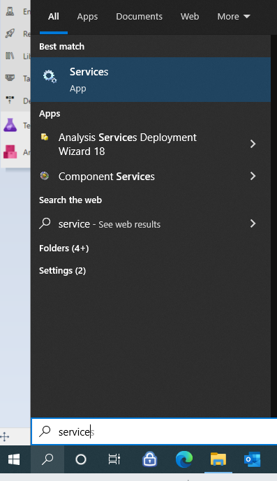
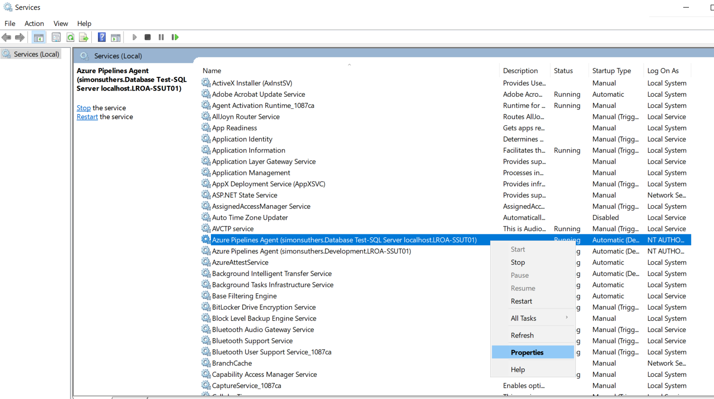

# Creating a deployment group

Deployment groups create a tunnel between Azure Devops and a deployment machine

- [Creating a deployment group](#Creating-a-deployment-group)
- [Adding a tag to the deployment group](#Adding-a-tag-to-the-deployment-group)
- [Setting the user for the deployment group](#Setting-the-user-for-the-deployment-group)

## Creating a deployment group

Go Deployment Groups and click on create:

Enter a name, tick the Use Personal Access Token box, then copy the token to the clipboard:

Paste the token on the clipboard into PowerShell and run. PowerShell should be running as administator. Use the PowerShell command as the ISE does not work. Follow the defaults in PowerShell:

The machine should now appear in Azure Devops:

## Adding a tag to the deployment group
A tag is used to identify the machine when creating a release.

Click on the machine name in deployment group:

In the summary tab, add a tag for the machine:

## Setting the user for the deployment group
Azure devops excutes on the machine under the accoutn of the service. To change the service account, find the service in Services:

Right-click on the service, and with properties change the account:

