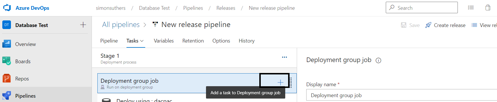

# Creating a release pipeline

A release pipeline implements Continuous Delivery/Deployment. It can automatically deploy code to a database when it is checked in, as long as it meets the criteria set out in Continuous Integration.

- [Creating a release pipeline](#Creating-a-release-pipeline)
  - [#Add the Continuous Integration Artifact]#(Add-the-Continuous-Integration-Artifact) 
  - [#Add deployment target]#(Add-deployment-target) 
- [Enable Continuous Deployment](#Enable-Continuous-Deployment)
- [Run the build pipeline](#Run-the-build-pipeline)
- [Implementing Continuous Integration](#Implementing-Continuous-Integration)

## Creating a release pipeline
### Add the Continuous Integration Artifact

Go to Releases, then click on New pipeline::

Select **Empty job** as a template:

In the basic template, click on Add an artifact:

When adding the artifact, choose Build as source type and choose the build pipeline created earlier:

### Add deployment target

To add a deployment target, click the **n job n task** link in the stage:

Click on the ... for the stage and choose **Add a deployment group job**:

Give the deployemnt job a sensible name. Set the Deployment group setting o the deployment group created earlier and the Required Tag setting to the tag of the deployment group created earlier:
- Deployment group: SQL Server localhost
- Required tags: localhost database

For the agent job, click on the job and then press remove in the far right-hand side:

For the Deployment group job, click on the + sign to add a task:

Find the SQL Server database deploy task, and press add:

Set the dacpac file location to the location in the artifact. Also set the server name and database name:

## Enable Continuous Deployment

