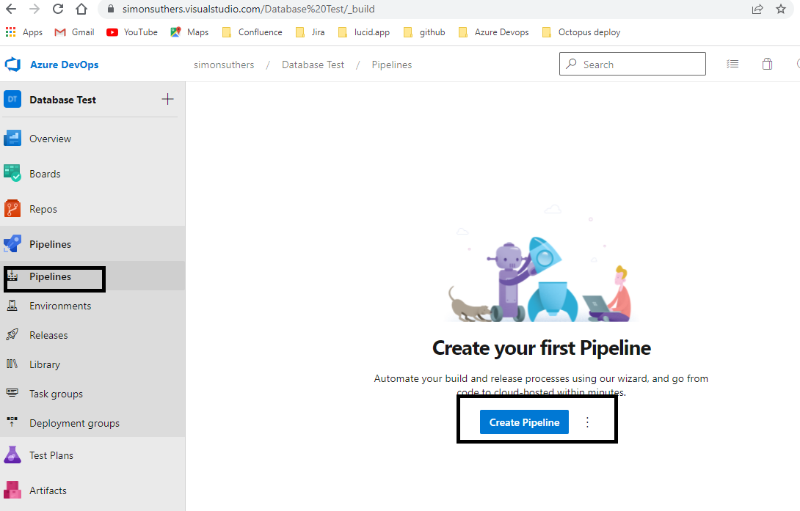

# Creating a release pipeline

A release pipeline implements Continuous Delivery/Deployment. It can automatically deploy code to a database when it is checked in, as long as it meets the criteria set out in Continuous Integration.

- [Creating a build pipeline](#Creating-a-build-pipeline)
- [Add jobs to the pipeline](#Add-jobs-to-the-pipeline)
- [Run the build pipeline](#Run-the-build-pipeline)
- [Implementing Continuous Integration](#Implementing-Continuous-Integration)

## Creating a build pipeline

Go to Pipelines, then click on create pipeline::

