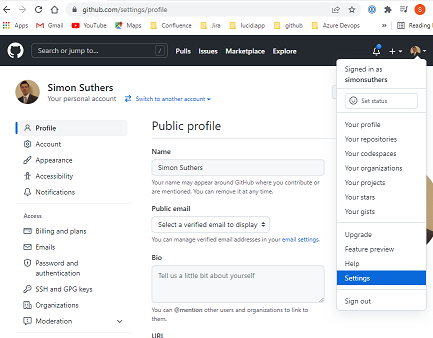
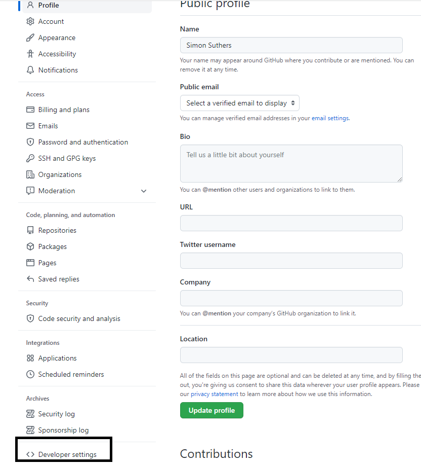
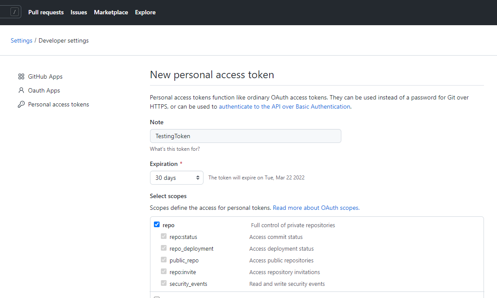

# Import Repo to Azure Devops

- [Create Github PAT](#Create-Github-PAT)
- [Import Repo to Azure](#Import-Repo-to-Azure)

## Create Github PAT
Go to github settings

In settings, find developer settings:

## Import Repo to Azure

