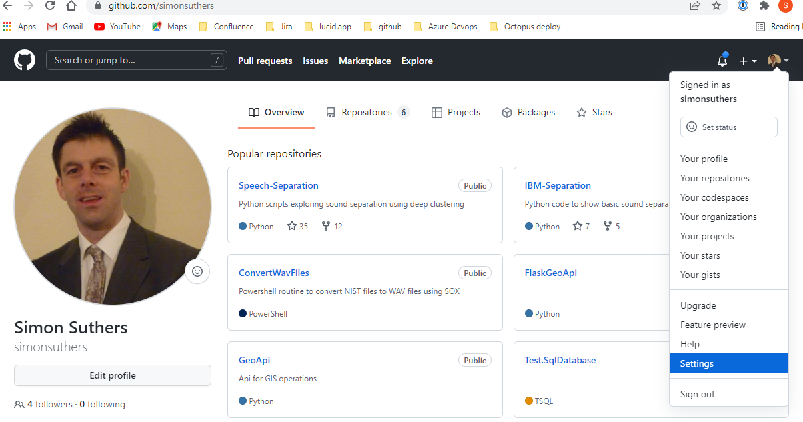
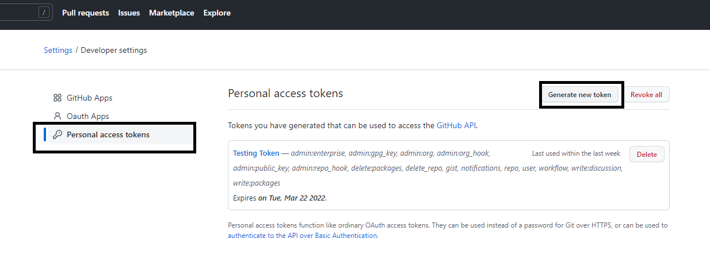
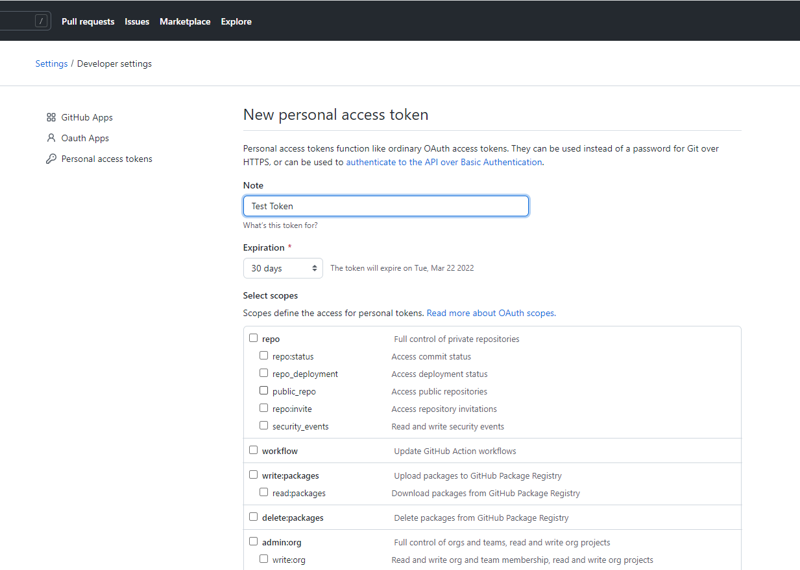

# Import Repo to Azure Devops

- [Create Github PAT](#Create-Github-PAT)
- [Import Repo to Azure](#Import-Repo-to-Azure)

## Create Github PAT
Go to github settings

In settings, find developer settings:

Click on Personal Access Tokens, then click on Generate new token:

Enter a name for the token, then copy the token to the clipboard:

## Import Repo to Azure
In Azure Devops, go to Repos:

In the Repo, find Import Repository:

Enter the url, PAT token and user name (the user name is the account name, not the login details from GitHub):

